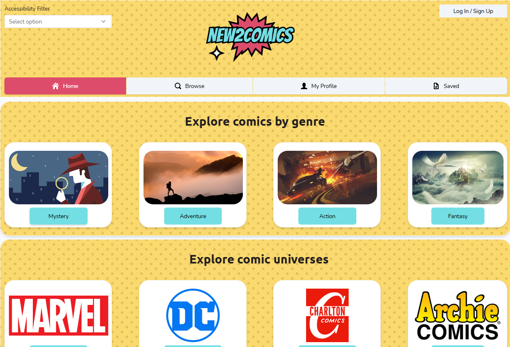
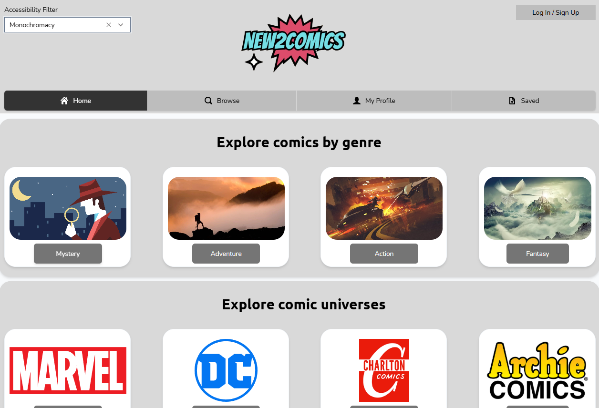

# New2Comics

New2Comics is a web application designed to make comic books accessible to first-time readers. 
By taking in user preferences across genres, characters, teams, and publishers, the app provides personalized comic recommendations with beginner-friendly overviews 
— no prior knowledge required. New2Comics removes the intimidation of getting into comics and lets users explore at their own pace.

FINAL APPLICATION SPECIFICATIONS
- Entities with full CRUD: Volume, User
- Relationships with full CRUD: preferredCharacter, preferredGenre, preferredPublisher, preferredTeam
- Other entities have partial CRUD
- User authentication is fully implemented: users can register and log in via the login page; a session token is returned on successful login and used to identify the current user throughout the application
- User registration validates for duplicate usernames and returns appropriate error responses
- Profile page: users can set their preferences (genre, publisher, character, team) which are then used to personalise search results and recommendations on the Browse and Home pages
- Browse page: search by genre, publisher, volume (comic series), character, or team; results are sorted by how closely they match the logged-in user's preferences. See VolumeRepository.java for the SQL query
- Home page: clicking a genre or universe (publisher) button leads to the Browse page with that term pre-entered in the search bar; recommendations are ordered by user preferences; popularity list is ordered by number of likes
- Volumes support like and save toggle functionality tied to the logged-in user
- About Us page included
- Data in data.sql is real comic book data with realistic popularity (numLikes) values
- Accessibility filter: users can switch the colour scheme to accommodate different visual needs; supported themes are Default, Dark, Deuteranopia, Protanopia, Tritanopia, and Monochromacy

## Screenshots

**Default theme**

*Home page showing genre and publisher browsing cards under the default yellow colour scheme.*

**Monochromacy accessibility theme**

*Same home page rendered in greyscale for users with monochromacy colour blindness.*
